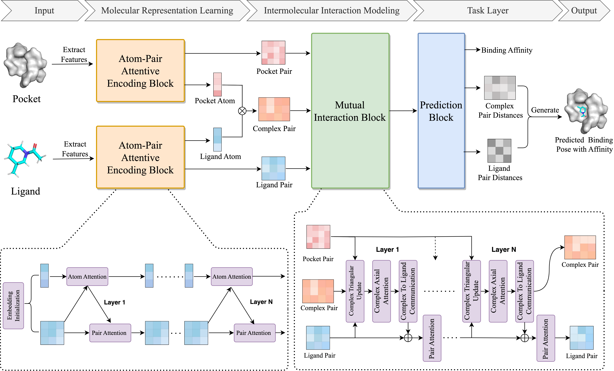

# GAABind
Code and trained model for our paper **GAABind: A Geometry-Aware Attention-Based
Network for Accurate Protein-Ligand Binding Pose
and Binding Affinity Prediction**


<br>

## Installation
You can set up the environment using **Anaconda** or **Docker**.
### Using Anaconda:
1. set up environment step by step: 
```bash
git clone https://github.com/Mercuryhs/GAABind.git
conda create --name gaabind python=3.8
conda activate gaabind
conda install pytorch==1.12.0 cudatoolkit=11.3 -c pytorch
pip install torch-scatter==2.0.9 torch-sparse==0.6.14 torch-cluster torch-geometric==2.0.4 -f https://data.pyg.org/whl/torch-1.12.0+cu113.html
pip install numpy pandas scikit-learn==1.2.1 tqdm rdkit-pypi==2021.9.5.1 nglview
```
2. set up environment by directly using `environment.yml`:
```
conda env create -f environment.yml
```
### Using Docker image:
```bash
git clone https://github.com/Mercuryhs/GAABind.git
docker pull mercuryyy/gaabind:latest
docker run --shm-size 8G --gpus all -it -v $PWD/GAABind:/GAABind gaabind:latest /bin/bash
```
### Build Docker image from scratch:
```bash
git clone https://github.com/Mercuryhs/GAABind.git
cd GAABind
docker build -t gaabind:latest .
docker run --shm-size 8G --gpus all -it -v $PWD:/GAABind gaabind:latest /bin/bash
```

<br>

## Dataset
The processed dataset can be downloaded from [zenodo](https://zenodo.org/records/10155792). If you want to train GAABind from scratch, or reproduce the GAABind results, you can:

1. download dataset from [zenodo](https://zenodo.org/records/10155792);
2. unzip the zip file and place it into data_path  `dataset`.

<br>

## Running GAABind on your own dataset
We provided both jupyter notebook tutorials and python scripts for running GAABind on your own dataset.

### 1. Usage examples can be seen directly in the `jupyter notebooks` included in the repo:
```bash
GAABind_example.ipynb
```

### 2. Predict your own molecules with the trained model in batch mode:
#### Step 1: Preprocess the dataset using the following format:
```shell
example_data/
├── Mpro-x11271
│   ├── ligand.txt
│   ├── pocket.txt
│   └── receptor.pdb
└── Mpro-x12715
    ├── ligand.txt
    ├── pocket.txt
    └── receptor.pdb
```
The ligand file can be in .sdf, .mol2, or .mol format, or you can provide the ligand's SMILES representation in a .txt file. The pocket.txt contains the residues of binding pockets, each residue is named by the chain, residue number, and three-letter abbreviation as follows:
```
A_166_GLU
A_49_MET
A_143_GLY
...
```
**Run the following command to preprocess the dataset**
```bash
python preprocess.py --input_path [raw_path] --output_path [processed_path]
```

#### Step 2: Predict the dataset using the following command
```bash
python predict.py --input_path [processed_path] --output_path [predict_path] 
```
Then you can find the prediction results in the `predict_path`.

<br>

## Reproducing paper numbers
Download and unzip the dataset, then place it into the `dataset` directory.

Running the following command to reproduce the evaluation result on `CASF2016`:
```bash
python inference.py --input_path dataset/PDBBind/processed --complex_list dataset/PDBBind/test.txt --output_path casf2016_predict_result --batch_size 3
```
Running the following command to reproduce the evaluation result on `Mpro dataset`:
```bash
python inference.py --input_path dataset/Mpro/processed --complex_list dataset/Mpro/test.txt --output_path mpro_predict_result --batch_size 2
```

## Training a model yourself
You can also retraining the model yourself by using the following command:
```bash
OMP_NUM_THREADS=8 CUDA_VISIBLE_DEVICES='0,1' torchrun --nproc_per_node=2 train.py --data_dir dataset/PDBBind
```

## Reference
```
Under Review
```